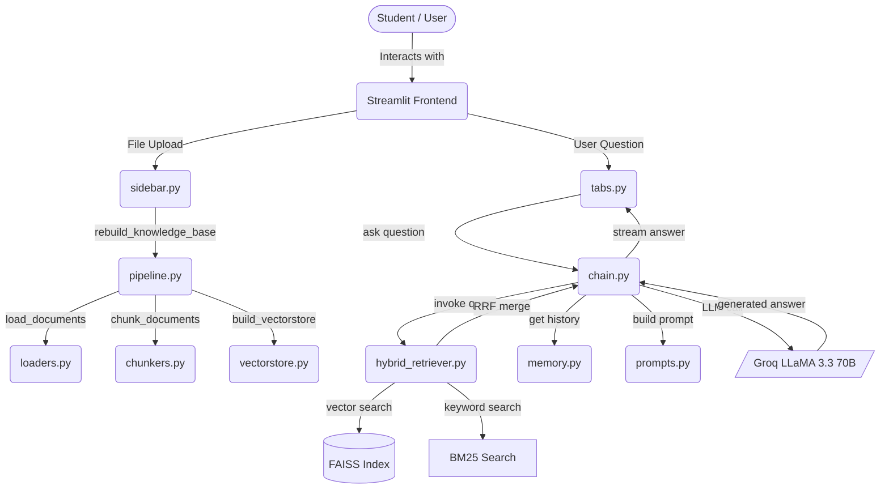
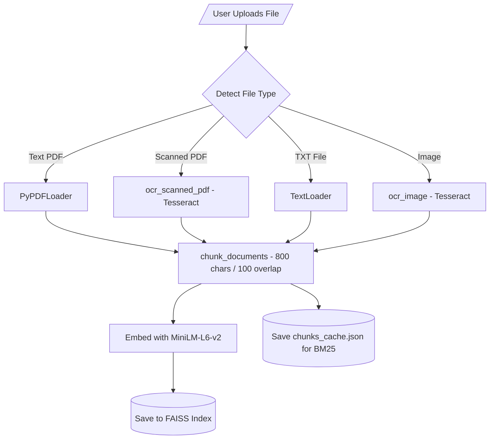
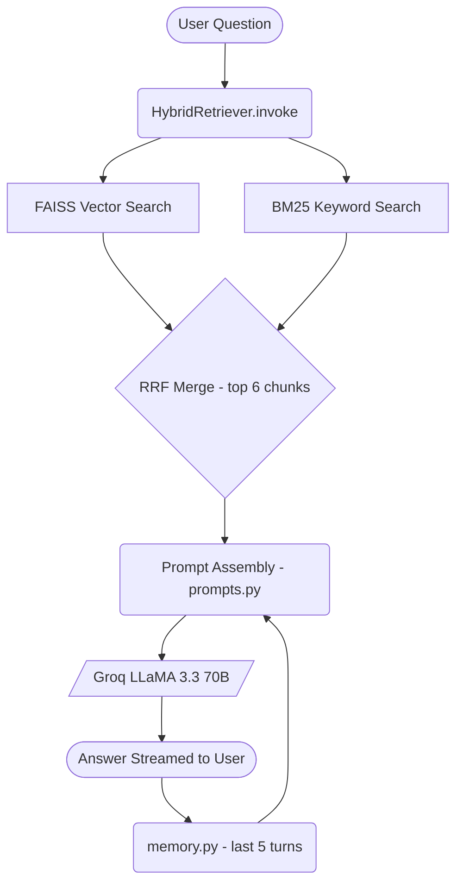
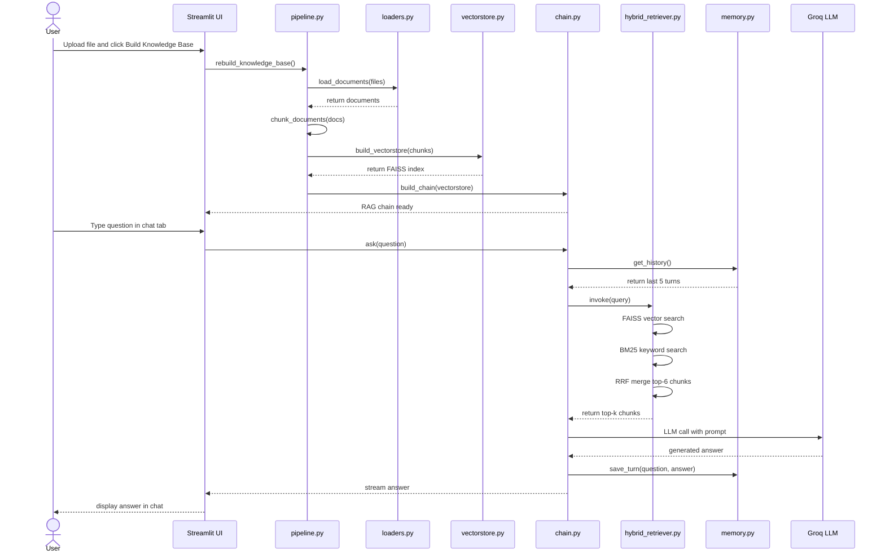
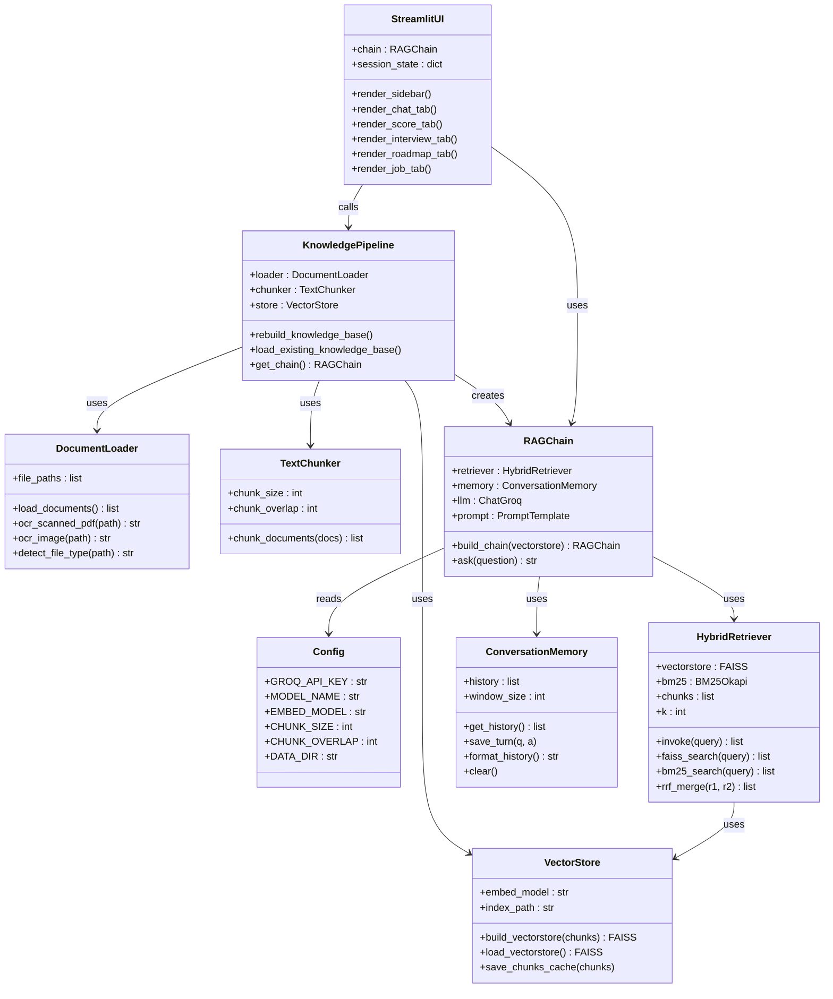

# CareerBot

CareerBot is an AI-powered career guidance chatbot built using Python and Streamlit. You upload your resume or marksheet, and the bot answers your career-related questions based only on what is in your documents. It does not make up information or use general knowledge.

---

## What This Project Does

CareerBot has five main features that you can access from different tabs in the app.

The first tab is Career Chat. You can ask the bot anything about your resume or career goals, and it will answer based on your uploaded documents. It also remembers the last few messages so you can ask follow-up questions naturally.

The second tab is Resume Score. The bot reads your resume and gives it a score out of 100. It tells you what is good, what is missing, and how to improve specific lines in your resume.

The third tab is Interview Prep. The bot generates interview questions based on your resume, including technical questions, HR questions, and tricky deep-dive questions. It also gives you model answers for each one.

The fourth tab is Career Roadmap. You enter your dream job and a timeframe, and the bot creates a month-by-month plan for you based on your current skills and background.

The fifth tab is Job Match. You paste any job description and the bot compares it with your resume. It gives you a match score, tells you which skills you have, which skills you are missing, and whether you should apply now or prepare more first.

---

## UML Diagrams

### 1. System Architecture

Shows all 5 layers — User, UI layer, Services, Core Engine, and External APIs.



---

### 2. Document Ingestion Pipeline

Shows how uploaded files are detected, loaded with OCR if needed, chunked, embedded, and saved to the FAISS index.



---

### 3. RAG Query Flow

Shows how a user question flows through hybrid retrieval, memory injection, prompt building, and the LLM to produce an answer.



---

### 4. Sequence Diagram

Shows the full order of interactions between all components from upload to answer.



---

### 5. Class Diagram

Shows all classes, their attributes, methods, and relationships.



---

## How It Works

When you upload a document, the app breaks it into small chunks of text and stores them in a database called a FAISS index. When you ask a question, the app searches for the most relevant chunks and sends them to the language model along with your question. The language model then generates an answer based only on those chunks.

The app uses two search methods together. One is vector search, which finds chunks that are semantically similar to your question. The other is keyword search using BM25, which finds chunks that contain the exact words you typed. The results from both methods are combined using a technique called Reciprocal Rank Fusion. This makes the search more accurate than using either method alone.

---

## Technologies Used

- Python 3.11
- Streamlit for the web interface
- LangChain for building the RAG pipeline
- Groq API with the Llama 3.3 70B model as the language model
- FAISS for storing and searching document embeddings
- Sentence Transformers for generating embeddings
- BM25 for keyword search
- Tesseract OCR for reading scanned PDFs and images
- RAGAS for evaluating the quality of the answers

---

## Project Structure

The app.py file is the main entry point. It sets up the page and loads all the tabs.

The core folder contains all the main logic. config.py holds all settings. loaders.py handles reading PDF, TXT, and image files. ocr.py handles scanned documents using Tesseract. chunkers.py splits documents into smaller pieces. vectorstore.py builds and saves the FAISS index. hybrid_retriever.py combines vector and keyword search. memory.py manages conversation history. chain.py builds the RAG chain and handles the ask function. prompts.py contains all the prompt templates used by the bot.

The services folder contains pipeline.py which handles building and loading the knowledge base, and actions.py which handles file uploads and deletions.

The ui folder contains the Streamlit interface. sidebar.py handles the file uploader and controls. tabs.py renders all five feature tabs. styles.py has the custom CSS. state.py initialises the session state.

The data folder is where uploaded documents are saved. The faiss_index folder is where the vector database is stored. evaluate.py is a script for testing the quality of the RAG pipeline using RAGAS metrics.

---

## How to Run the Project

First, install the system dependencies. On Ubuntu or Debian, run the following command.

```bash
sudo apt-get install -y tesseract-ocr poppler-utils
```

On macOS, run the following command.

```bash
brew install tesseract poppler
```

Next, clone the repository and go into the project folder.

```bash
git clone https://github.com/your-username/careerbot.git
cd careerbot
```

Create a virtual environment and activate it.

```bash
python -m venv .venv
source .venv/bin/activate
```

Install the Python packages.

```bash
pip install -r requirements.txt
```

Create a file called .env in the project folder and add your Groq API key like this.

```
GROQ_API_KEY=your_key_here
```

Finally, run the app.

```bash
streamlit run app.py
```

Then open your browser and go to http://localhost:8501.

---

## How to Use the App

Upload your resume or any document using the sidebar on the left. Then click the Build Knowledge Base button. Once that is done, you can use any of the five tabs to interact with your documents.

The knowledge base is saved to disk, so you do not need to rebuild it every time you open the app. You only need to rebuild it when you add or remove a document.

---

## Evaluation

The project includes an evaluation script that tests the quality of the RAG pipeline using RAGAS. It runs ten career-related questions through the pipeline and measures four things: whether the answers are faithful to the retrieved context, whether the answers are relevant to the questions, whether the retrieved chunks were precise, and whether the retrieval captured all necessary information.

To run the evaluation, first build the knowledge base through the app, then run the following command.

```bash
python evaluate.py
```

The results will be printed in the terminal and also saved to a file called ragas_results.csv.

---

## What I Learned

This project helped me understand how Retrieval-Augmented Generation works in practice. I learned how to load and process different types of documents, how to chunk text and store it in a vector database, how to combine vector search and keyword search for better retrieval, how to inject conversation history into a prompt, and how to evaluate a RAG system using standard metrics.

---

## Author

Built by Prasanna Konduri as a learning project to explore LangChain, FAISS, and large language models.